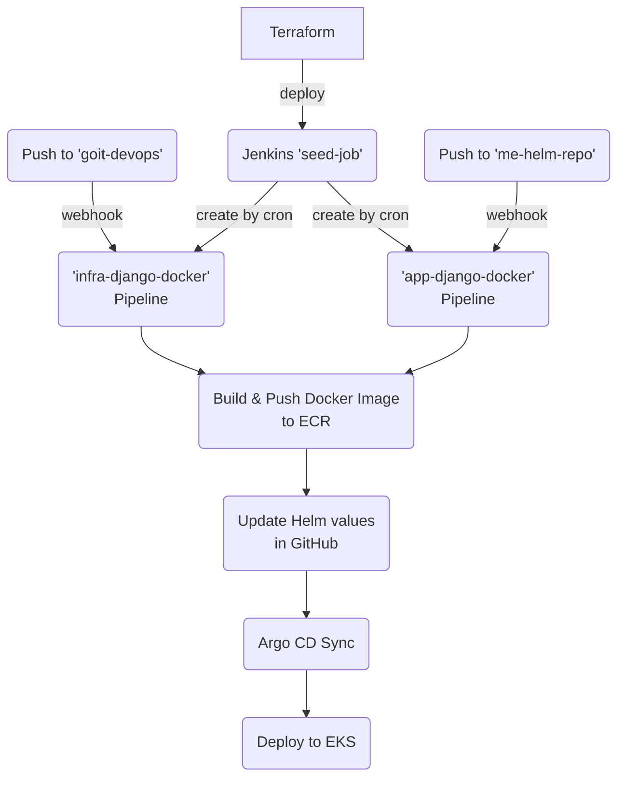

# goit-devops: Infrastructure & CI/CD

## Опис

Цей репозиторій містить інфраструктурний код для автоматичного деплою Django-проєкту з використанням AWS, Kubernetes, Jenkins, Argo CD, Helm та Terraform.

### Основні компоненти:

- **Terraform** — автоматичне створення AWS-ресурсів (EKS, ECR, S3, IAM, VPC, Jenkins, Argo CD)
- **Jenkins** — CI/CD пайплайн для збірки, тестування та деплою
- **Argo CD** — GitOps CD для Kubernetes
- **Helm** — менеджер чартів для деплою застосунків

---

## Схема CI/CD



## Як застосувати Terraform

1. **Передумови:**

   - AWS CLI налаштований
   - kubectl, helm, terraform встановлені
   - GitHub PAT (Personal Access Token) для Jenkins

2. **Запуск:**
   ```powershell
   $env:TF_VAR_github_pat="<your_github_pat>"
   terraform init
   terraform apply -auto-approve
   ```
   > **Примітка:** PAT передається як змінна середовища для створення Jenkins credentials.

---

## Як перевірити Jenkins job

1. **Доступ до Jenkins UI:**

   - Дізнайтесь зовнішній адресу Jenkins (LoadBalancer або Ingress)
   - Відкрийте у браузері: `http://<jenkins-address>:8080`
   - Увійдіть під admin (логін/пароль виводиться при деплої)

2. **Перевірка job:**

   - Знайдіть seed-job
   - Запустіть вручну або дочекайтесь автоматичного запуску cron через 5хв.
   - Перевірте статус виконання та логи job
   - Результатом виконання є створення пайплайну з назвою goit-django-docker
     


---

## Як побачити результат в Argo CD

1. **Доступ до Argo CD UI:**

   - Дізнайтесь адресу Argo CD (LoadBalancer або Ingress)
   - Відкрийте у браузері: `http://<argocd-address>:8080`
   - Увійдіть під admin (пароль — початковий або змінений)

2. **Перевірка застосунків:**
   - Знайдіть ваш Application (наприклад, django-app)
   - Переконайтесь, що статус — Synced, Healthy
   - Перегляньте ресурси, поди, логи, події


---

## Корисні команди

- Перевірити pod Jenkins:
  ```
  kubectl get pods -n jenkins
  kubectl logs jenkins-0 -n jenkins
  ```
- Перевірити pod Argo CD:
  ```
  kubectl get pods -n argocd
  kubectl logs <argocd-server-pod> -n argocd
  ```
- Перевірити Helm values:
  ```
  helm get values jenkins -n jenkins
  ```
- Перевірити credentials у Jenkins UI:
  - Manage Jenkins → Credentials → (global)

---

## Додатково

- Для зміни PAT — змініть змінну TF_VAR_github_pat і повторіть terraform apply
- Для оновлення застосунку — зробіть git push у відповідний репозиторій
- Для ручного деплою в Argo CD — натисніть Sync у UI
