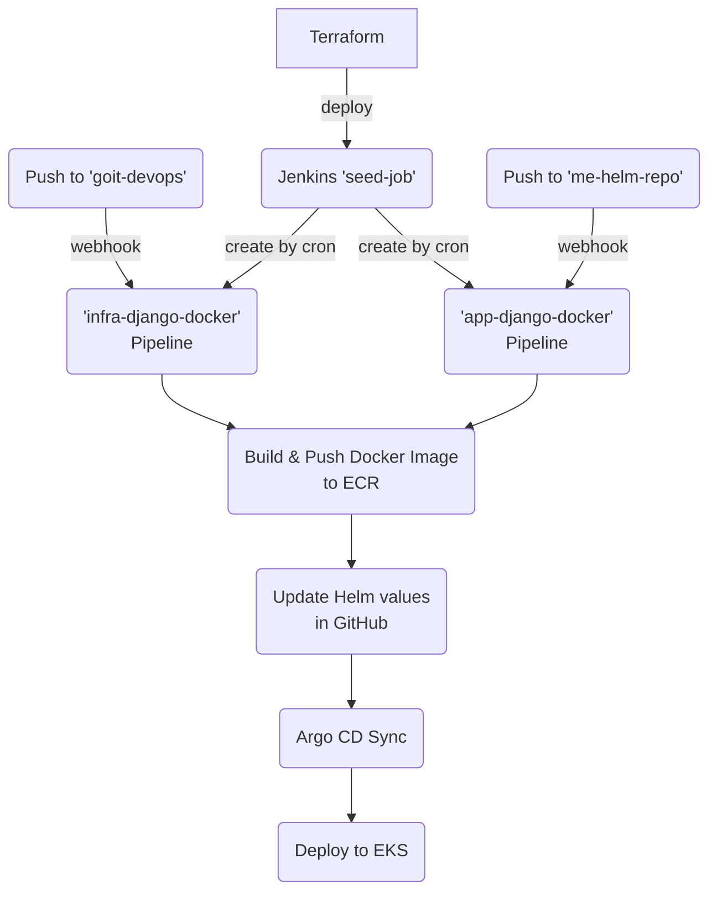

# goit-devops: Infrastructure & CI/CD

## Опис

Цей репозиторій містить інфраструктурний код для автоматичного деплою Django-проєкту з використанням AWS, Kubernetes, Jenkins, Argo CD, Helm та Terraform.

### Основні компоненти:

- **Terraform** — автоматичне створення AWS-ресурсів (EKS, ECR, S3, IAM, VPC, Jenkins, Argo CD)
- **Jenkins** — CI/CD пайплайн для збірки, тестування та деплою
- **Argo CD** — GitOps CD для Kubernetes
- **Helm** — менеджер чартів для деплою застосунків
- **Репозиторій 'goit-devops'** - репозиторій для інфраструктирних змін
- **Репозиторій 'me-helm-repo'** - репозиторій для змін в нашому аплікейшені 'django-app'
---

## Схема CI/CD



## Як застосувати Terraform

1. **Передумови:**

   - AWS CLI налаштований
   - kubectl, helm, terraform встановлені
   - GitHub PAT (Personal Access Token) для Jenkins

2. **Запуск:**
   ```powershell
   $env:TF_VAR_github_pat="<your_github_pat>"
   terraform init
   terraform apply -auto-approve
   ```
   > **Примітка:** PAT передається як змінна середовища для створення Jenkins credentials.

---

## Як перевірити Jenkins job

1. **Доступ до Jenkins UI:**

   - Дізнайтесь зовнішній адресу Jenkins (LoadBalancer або Ingress)
   - Відкрийте у браузері: `http://<jenkins-address>:8080`
   - Увійдіть під admin (логін/пароль виводиться при деплої)

2. **Перевірка job:**

   - Знайдіть seed-job
   - Запустіть вручну або дочекайтесь автоматичного запуску cron через 5хв.
   - Перевірте статус виконання та логи job
   - Результатом виконання є створення двох пайплайнів з infra-django-docker та app-django-docker


---
## Як перевірити роботу пайпланів
1. **Обираємо infra-django-docker**  

  
- якщо всі кроки в пайплайні зелені, то значить наш Push відбувся в потрібну гілку та всі кроки виконано успішно
- якщо в пайплайн від блоку Check Commit Message всі наступні кроки червоні, то така поведінка характерна для запобігання зациклення виконання пайплайну. Це виникає із-за того, що одним із кроків в середені нашого пайплайну є Push. І так як webhook також спрацьовує на цей Push, то він буде тригерити виконання пайплайну постійно. Такий варіант потрібно вважати також успішним і, навіть, необхідним
- якщо в пайплайні інші варіації або помилки - необхідно досліджувати логи та повідомлення     

2. **Обираємо app-django-docker**  


- якщо всі кроки в пайплайні зелені, то значить наш Push відбувся в потрібну гілку та всі кроки виконано успішно
- якщо в пайплайні інші варіації або помилки - необхідно досліджувати логи та повідомлення 

---

## Як побачити результат в Argo CD

1. **Доступ до Argo CD UI:**

   - Дізнайтесь адресу Argo CD (LoadBalancer або Ingress) або запустіть port-forward на потрібний порт (Наприклад: 8081)
   - Відкрийте у браузері: `http://<argocd-address>:8081` або `http://localhost:8081
   - Увійдіть під admin (пароль — початковий або змінений)

2. **Перевірка застосунків:**
   - Знайдіть ваш Application (наприклад, django-app)
   - Переконайтесь, що статус — Synced, Healthy
   - Перегляньте ресурси, поди, логи, події
   - На поді має бути зазначено образ з тегом останнього білда


## Перевірка django-app
   - Після Push наших змін у me-helm-repo з нашим аплікейшеном та успішним відпрацюванням пайплайну, зміни мають відображатись на сторінці аплікейшену 

